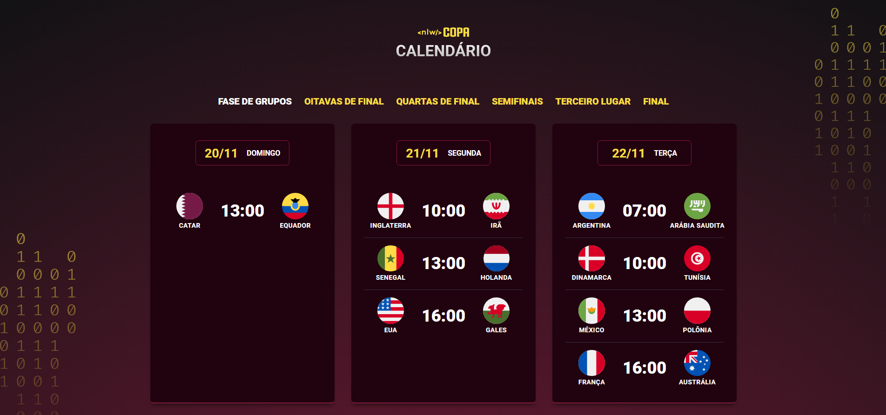
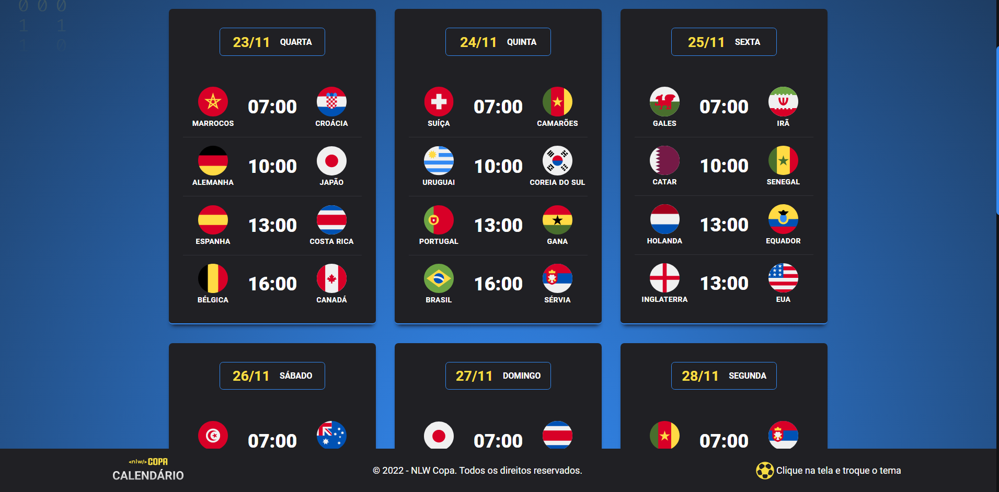

<h1 align="center"> NLW - COPA</h1>

    

    

Projeto desenvolvido no evento exclusivo e gratuito, promovido pela Rocketseat para ensino de tecnologias WEB.

  <a href="#-tecnologias">Tecnologias</a>&nbsp;&nbsp;&nbsp;|&nbsp;&nbsp;&nbsp;
  <a href="#-projeto">Projeto</a>&nbsp;&nbsp;&nbsp;|&nbsp;&nbsp;&nbsp;
  <a href="#-layout">Layout</a>&nbsp;&nbsp;&nbsp;|&nbsp;&nbsp;&nbsp;
  <a href="#memo-licença">Licença</a>

  

 

  

## 🚀 Tecnologias

Esse projeto foi desenvolvido com as seguintes tecnologias:

- HTML
    - Estruturação da página 
    - Semântica
- CSS
    - Variáveis
    - Posicionamentos
    - Classes
    - Pseudo-elementos
    - Pseudo-classes
    - Flexbox
    - webkit-scrollbar
- JavaScript
    - Introdução ao JavaScript
    - Eventos JavaScript
    - Função

## 💻 Projeto

O NLW - Copa é um calendário com todos os jogos da copa do mundo Qatar 2022. O usuário confere todas as datas e horários, podendo trocar a cor do site também.

## 🔖 Layout

Você pode visualizar o layout do projeto através [DESSE LINK](https://www.figma.com/proto/mn8ZraNDJ21bT9KFrWt3p9/Calend%C3%A1rio-de-Jogos-(Community)?node-id=114%3A165&scaling=min-zoom&page-id=0%3A1). É necessário ter conta no [Figma](https://figma.com) para acessá-lo.

## :memo: Licença

Esse projeto está sob a licença MIT.

---

Projeto feito por Ingrid Santos oferecido pela Rocketseat 